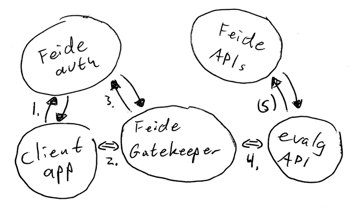

Authentication and authorization
================================

The evalg api (this application) is designed to integrate with `Feide`_
2.0/Dataporten.  This means that:

- The evalg api is intended to only be reachable through a Feide Gatekeeper.
- A client application (e.g. the frontend) needs to authenticate users using the
  Feide OpenID Connect apis. Note that the client must explicitly ask for
  permission (scopes) to access this application.

Configuration
-------------
To set up authentication with Dataporten, the following configuration should be
defined:

::

  AUTH_ENABLED = True
  AUTH_METHOD = 'feide'

  FEIDE_BASIC_REQUIRE = True
  FEIDE_BASIC_USERS = [
      ('<username>', '<password>'),
  ]

The ``<username>`` and ``<password>`` pair should be replaced with values
supplied by the Feide Gatekeeper for your application.

Registration
------------
TODO: Describe how to set up a gatekeeper and client in the dataporten
dashboard.

Mocking
-------
During day-to-day development, it is easier mock an integration with
Feide/Dataporten, rather than setting up a real integration.

The application provides a mocking interface that bypasses the Feide dependency.

.. warning::
   The Feide mock middleware is only for use in local dev environments.
   Feide mocking effectively disables all forms of authentication and
   authorization.

When using the mock authentication middleware, all users are by default logged
in as a single user.  You'll have to provide some data for that user in the
evalg configuration file:

::

  AUTH_ENABLED = True
  AUTH_METHOD = 'feide_mock'

  # A feide 'user_id' uuid  - we pretend that requests comes from this user
  FEIDE_MOCK_LOGIN_AS = 'abababab-abab-abab-abab-abababababab'

  # client_id and a dict with user_info
  FEIDE_MOCK_DATA = {
      'client_id': 'fafafafa-fafa-fafa-fafa-fafafafafafa',
      'users': {
          'abababab-abab-abab-abab-abababababab': {
              'id': 'abababab-abab-abab-abab-abababababab',
              'sec': {
                  'feide': ('testesen@example.com', ),
                  'nin': ('01011012343', ),
              },
              'dp_user_info': {
                  'user': {
                      'name': 'Test Testesen',
                      'email': 'testesen@example.com',
                  },
                  'audience': 'mock',
              },
              'feide_user_info': {
                  'eduPersonEntitlement': ('urn:mace:uio.no:evalg:valgadministrator', )
              }
          },
      },
  }

Authorization using Feide
-------------------------

   The diagram shows how an evalg client would communicate with Feide to
   authenticate, and our Feide Gatekeeper to communicate with the evalg
   application.

..
              +--------------+               +--------------+
              |              |               |              |
              |  Feide auth  |               |  Feide apis  |
              |              |               |              |
              +--------------+               +--------------+
               ↑↓          ↑↓                       ↑↓
   +--------------+     +--------------+     +--------------+
   |              |     |              |     |              |
   |  evalg app   | <=> |  Gatekeeper  | <=> |  evalg api   |
   |              |     |              |     |              |
   +--------------+     +--------------+     +--------------+

1. **Client authenticates the user using Feide.**  The client performs
   authentication using OIDC, and asks for access to the evalg api. If the user
   authenticates, the client will get an authorization token from Feide that
   should grant access to the evalg api.

2. **Client sends a request to the evalg Gatekeeper.**  Along with the request
   is an Authorization header that includes the token from step 1.

3. **The Gatekeeper verifies client credentials.**  It checks that the token is
   valid, and that it grants access to the evalg api.

4. **The Gatekeeper forwards the request to the evalg api.**  If the
   authorization token is valid, the request is forwarded to the actual evalg
   api. Included with the request are headers with:

   - Information about the authorized user or client
   - An authorization token that the evalg api can use with other Feide
     services. This token grants the evalg api access to e.g. look up user
     information on behalf of the user.

5. The evalg api looks up user data as needed from the feide apis.

.. _Feide: https://docs.feide.no/
